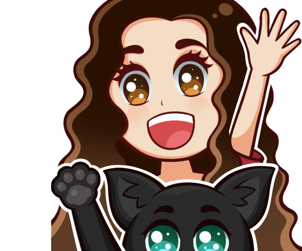
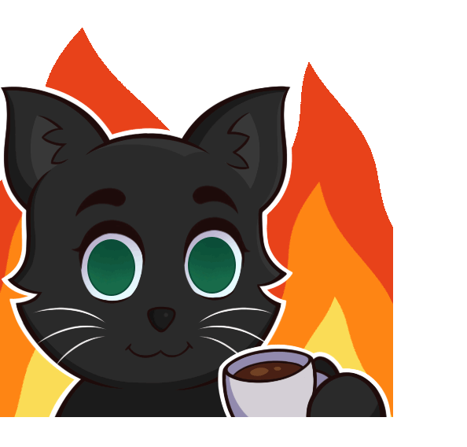

<h1 align="center">< Hello World! 👋 I'm Brunna /></h1>
<h3 align="center">A passionate FrontEnd Developer from Brazil</h3>

    
    

    <h3>About me:</h3>
    
    I've been passionate about computers since I was 7 years old (2005) where I started to learn and use the Office and Adobe package at the NGO Rio Feliz. My career in IT began in the second half of 2019, when I started the Computer Science course at Centro Universitário Carioca. I am currently in the last period, missing only two disciplines and the TCC (final paper) that is already in progress.
        
Today I seek to improve myself as a front-end developer and reach places to make a difference in the world.

    

<h3>Find me around the web:</h3>

<h3>Front End development skills:</h3>

<h3>Design skills:</h3>

<h3>I'm learning:</h3>

<h3>Some Fun Facts about me:</h3>

    
• I love playing video games and you'll find me playing games on my <a href="https://twitch.tv/kayzeri">Twitch Channel</a> and live coding!

    
• My first art in Photoshop was for my mother on Mother's Day when I was 8 years old, too bad I didn't know drivers existed at that time.

    
• It took a while, but in 2022 I started my own digital design brand on instagram as BruDesignn, you can <a href="https://www.instagram.com/brudesignn_/">see it here</a>

<h1></h1>

    <h3>I'm a gamer too, so you might find me on:</h3>
    
    
    
    

<h3>My specs:</h3>

<h1></h1>
